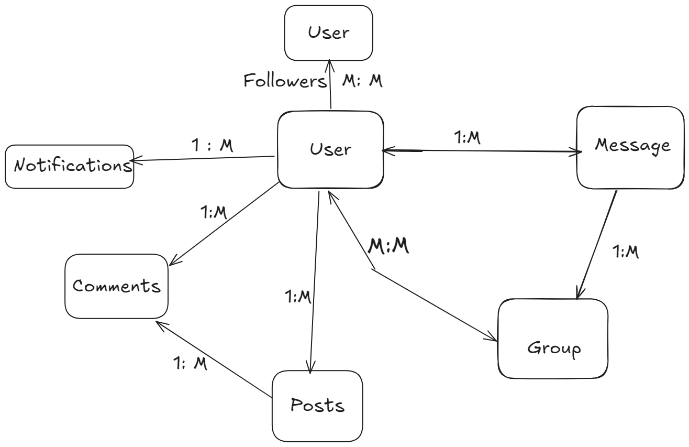
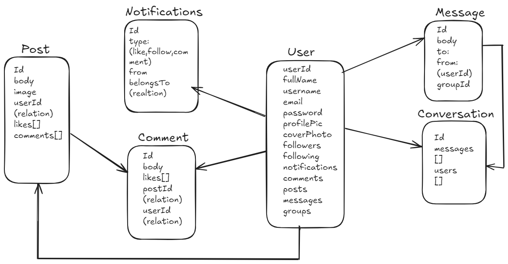

# Konekt

A social media application where users can post, like , comment and follow other users.


## Demo

http://konekt.s3-website.eu-north-1.amazonaws.com/


## Technologies Used

[](https://skillicons.dev)
## Features

- Authentication & Authorization with JWT
- Create Post with/without photo
- Delete/edit Post
- Like/Unlike Post
- Create/edit/delete Comment to a Post
- Follow/Unfollow Users
- Update Profile
- Notifications
- Suggested Users
- State management with recoil
- Deployed on AWS


## Setup .env file

PORT=...  
DATABASE_URL=...  
ACCESS_TOKEN_SECRET=...  
REFRESH_TOKEN_SECRET=...  
CLOUDINARY_CLOUD_NAME=...  
CLOUDINARY_API_KEY=...  
CLOUDINARY_API_SECRET=...  
## Run Locally

Clone the project

```bash
  git clone https://github.com/Mujtaba500/social_media_app.git
```

Go to the project directory

```bash
  cd social_media_app
```

Install Node Version Manager

```bash
  nvm install
```

Use node js version from .nvmrc 

```bash
  nvm use
```


Install dependencies

```bash
  npm install
```

Start the server

```bash
  npm run dev
```

For client side

```bash
  cd client
  npm install
  npm run dev
```


## Schema




